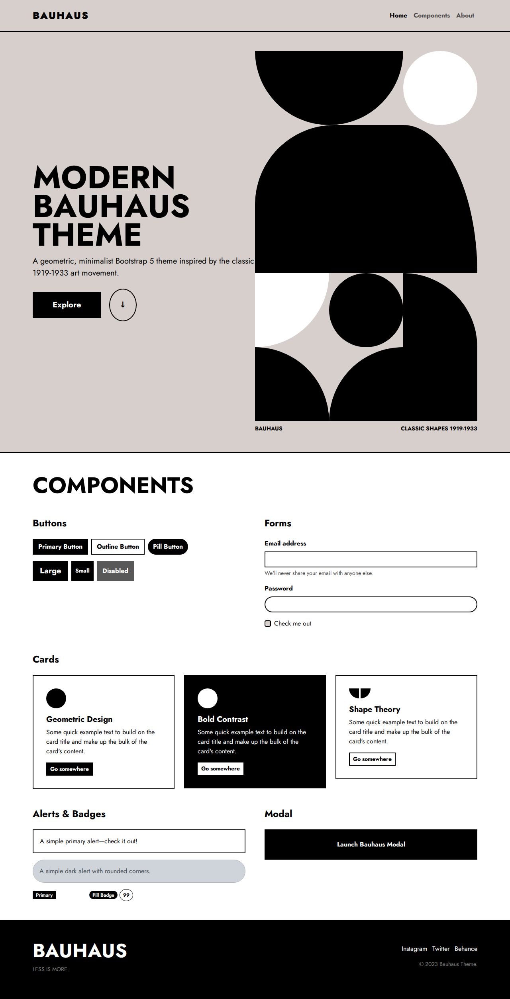

# Bauhaus Theme

A modern, geometric, minimalist Bootstrap 5 theme inspired by the classic 1919-1933 Bauhaus art movement.

## Preview



## About

This project is a recreation of the Bauhaus style using modern web technologies. It features:
- Geometric shapes and layout
- High contrast design (Black, White, Beige, Primary Blue)
- Custom Bootstrap 5 theme
- Responsive design

## Usage

To run this project locally:

1. Clone the repository.
2. Install dependencies:
   ```bash
   npm install
   ```
3. Run the development server:
   ```bash
   npm run dev
   ```
4. Build for production:
   ```bash
   npm run build
   ```
